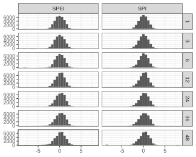

```{r}
#| label: "common"
#| include: FALSE
# Final notebook, only loading of env required.
# Saves time to not save the image again, which will not be needed by README
if (file.exists(here::here("environment.RData"))) {
  load(here::here("environment.RData"))
}
library("here"); library("data.table"); library("ggplot2")
dir_figs <- fs::dir_create("figures") # folder to save figures
```
```{r}
#| label: "chunk-ops"
#| include: FALSE
fig_width <- 4.5
fig_height <- fig_width * 0.618
knitr::opts_chunk$set(
    out.width = "100%",
    fig.width = fig_width, # reasonable size
    fig.asp = 0.618,       # golden ratio
    fig.align = "center"
)
```

# About
This document showcases and visualizes the results of exploring how two drought indices,
Standardized Precipitation Index (SPI) and Standardized Precipitation Evaporation Index (SPEI) can
be used to approximate or forecast groundwater conditions.
Groundwater levels from monitoring pipes were converted into Standardized Groundwater Index (SGI) values for making the comparisons compatible.
However, I encountered some issues, which I could not fully address in time. Here I present the data story of discovering these issues.


# Technical overview
These visualizations are created with the `R` programming language using the `ggplot2` package.
The package `SEI` is also used for convenience for plotting ribbon time series of standardized indices.
There are no custom visualization functions etc. Everything is done through the declarative syntax of plotting libraries.

The final figures have not been altered or adjusted outside of this code.
Only the figures needed in README were saved as files outside of this document. Although easily accomplished, most were not saved to keep the code compact.

::: {.callout-important}
[comment]: # (no need to label (#imp-previous), as not cross-referenced)
Details on the data downloads and processing can be found in the previous notebooks (SE 1-3).
:::

A technical workaround (`_common.R`) was used to get multiple consequtive Quarto documents to share one R environment.
This could have been avoided by saving intermediary data processing products on disk in tabular format.
However, the approach taken brings some convenience. All object classes, factor levels and their order etc. are now preserved. Saving objects as `csv`s would require writing wrapper functions for file-reading to ensure consistent object attributes/metadata. These intermediary data files need to only be valid for the duration of the project rendering, so "universal" storage is not necessary. Some heavy object calculation results were saved also on disk for more rapid code development.  
By the end of making this document I learned that perhaps this is not ideal, as loading and saving the environment every time you want to render a file gets quite slow. And getting a notebook render to visually look just the way you like it *takes A LOT of tweaking*!!! The rendering time could be reduced if only the absolute necessary objects were loaded from their specific files. This approach, as recommended by the course materials,
would have also improved the portability and reprodicibility of the code, as all the object dependencies would
have been more explicit in the code.


# Discovering the issues
I encountered some serious limitations in the usability of my selected drought index dataset.

## Dataset overview
For my initial quality control I simply dropped some extreme (< -1000) values I observed. Afterwards the data looked reasonable (@fig-index-hist).
```{r}
#| label: fig-index-hist
#| fig-cap: "Total value distributions of the SPI and SPEI drought indices, grouped by accumulation period."
#| out-width: 80%
ggsave("spi_spei_hists.svg", path=dir_figs, width=fig_width, height=fig_width*0.8, plot=
  ggplot(station_sgi_w_dr_inds) + geom_histogram(aes(value), bins=30) +
  # stat_function(fun = function(x) dnorm(x, mean=0, sd=1) * 10000) +
  facet_grid(cols=vars(ind_type), rows=vars(ind_accum)) + labs(y=NULL, x=NULL) + theme_bw()
)
```
{#fig-index-hist}


The drought indices (SPI, SPEI) have been obtained from an ERA5-based global time series of ready-made drought indices. (Links in README.)
Each studied groundwater station was approximately located within one raster cell (~28x28 km) of the drought index dataset.
Thus, each station had its drought index time series obtained from its single corresponding cell.

## Station-level data
Although the distributions of drought index values looked reasonable (@fig-index-hist), upon closer inspection some stations had very sudden jumps in the fit between SGI and the drought indices.

A station with bad data (0902) in [@fig-bad-rmse-1; @fig-bad-rmse-2], and a station with OK data (0703) in @fig-bad-rmse-3.
```{r}
#| label: fig-bad-rmse
#| column: margin
#| out-width: 110%
#| fig-cap: "Drought index fit (RMSE) to the SGI time series of monitoring pipes. Each pipe has a heatmap for both drought indices (columns in panels). The drought index accumulation periods are on the vertical axis, and the studied offset lag in months on the horizontal axis. White crosses indicate the optimum combination of lag and accumulation. A lag of 0 is indicated with a vertical line."
#| fig-subcap: 
#|   - "Problematic station, with unreasonably bad RMSE fit for the whole SPEI 6-month accumulation period."
#|   - "The correlations of the same station. The bad SPEI-6 fit is less visible, but still noticeable. (SPEI-6 too blue)"
#|   - "A station with RMSE appearing normal."
## #| layout: [[1],[1],[1]]  ## [[47,-5,47], [70]]
plt1 <- ggplot(pipe_rmse[station_id=="0902"],
    aes(lag_months, factor(ind_accum), fill=RMSE)) +
  geom_tile() + geom_vline(xintercept=0, color="black") + 
  geom_point(data=pipe_rmse_smry[station_id=="0902"], color="white", size=3, pch="cross", stroke=1) +
  facet_grid(rows=vars(ind_type), cols=vars(paikka_id)) +
  scico::scale_fill_scico("RMSE", palette="bilbao") +
  coord_cartesian(expand=F) + labs(x="Lag (months)", y="Accumulation period")
print(plt1); ggsave("bad-rmse-station.png", path=dir_figs, plot=plt1, width=fig_width, height=fig_height) # Show and save
ggplot(pipe_cor[station_id=="0902"],
    aes(lag_months, factor(ind_accum), fill=estimate)) +
  geom_tile() + geom_vline(xintercept=0, color="black") + 
  geom_point(data=pipe_cor_smry[station_id=="0902"], color="white", size=3, pch="cross", stroke=1) +
  facet_grid(rows=vars(ind_type), cols=vars(paikka_id)) +
  scico::scale_fill_scico("Correlation", palette="vik") +
  coord_cartesian(expand=F) + labs(x="Lag (months)", y="Accumulation period")
ggplot(pipe_rmse[station_id=="0703"],
    aes(lag_months, factor(ind_accum), fill=RMSE)) +
  geom_tile() + geom_vline(xintercept=0, color="black") + 
  geom_point(data=pipe_rmse_smry[station_id=="0703"], color="white", size=3, pch="cross", stroke=1) +
  facet_grid(rows=vars(ind_type), cols=vars(paikka_id)) +
  scico::scale_fill_scico("RMSE", palette="bilbao") +
  coord_cartesian(expand=F) + labs(x="Lag (months)", y="Accumulation period")
```

The problematic SPEI-6 time series of the station 0902 identified from @fig-bad-rmse-1 appears vastly different to
the station's 12-month accumulation variant of the same index, as seen in @fig-prob-station-spei.
The bad SPEI-6 time series has almost periodic extreme negative values, with occasional positive extremes.
```{r}
#| label: fig-prob-station-spei
#| layout-ncol: 2
#| out-width: 130%
#| fig-cap: "The SPEI time series of the problematic station 0902 for accumulation periods of 6 and 12 months. The color indicates negative or positive anomalies."
#| fig-subcap:
#|   - "Station 0902, SPEI-6"
#|   - "Station 0902, SPEI-12"
prob_station <- "0902"
plt2 <- SEI::plot_sei(station_spi_spei_ts[station_id == prob_station & dr_ind == "SPEI6"]$value)
print(plt2); ggsave("bad-station-ts.png", path=dir_figs, plot=plt2, width=fig_width, height=fig_height) # Show and save
SEI::plot_sei(station_spi_spei_ts[station_id == prob_station & dr_ind == "SPEI12"]$value)
```

The SPI equivalents of the station are almost normal, apart from the extreme values at the start.
```{r}
#| label: fig-prob-station-spi
#| layout-ncol: 2
#| out-width: 130%
#| fig-cap: "The SPI time series of the station 0902 for accumulation periods of 6 and 12 months. The color indicates negative or positive anomalies."
#| fig-subcap:
#|   - "Station 0902, SPI-6"
#|   - "Station 0902, SPI-12"
SEI::plot_sei(station_spi_spei_ts[station_id == prob_station & dr_ind == "SPI6"]$value)
SEI::plot_sei(station_spi_spei_ts[station_id == prob_station & dr_ind == "SPI12"]$value)
```


Another station (0302) has problems with SPEI-36, whereas its SPEI-24 (and others) look very regular:
```{r}
#| label: fig-prob-station2
#| layout-ncol: 2
#| layout-nrow: 2
#| out-width: 130%
#| fig-cap: "The SPEI time series of the station 0302 for accumulation periods of 36 and 24 months. The color indicates negative or positive anomalies. The time series are accompanied with a histogram of all the index values in the time series."
#| fig-subcap:
#|   - "Station 0302, SPEI-36"
#|   - "Station 0302, histogram of SPEI-36"
#|   - "Station 0302, SPEI-24"
#|   - "Station 0302, histogram of SPEI-24"
prob_station2 <- "0302"
SEI::plot_sei(station_spi_spei_ts[station_id == prob_station2 & dr_ind == "SPEI36"]$value)
hist(station_spi_spei_ts[station_id == prob_station2 & dr_ind == "SPEI36"]$value, xlab=NULL, main=NULL)
SEI::plot_sei(station_spi_spei_ts[station_id == prob_station2 & dr_ind == "SPEI24"]$value)
hist(station_spi_spei_ts[station_id == prob_station2 & dr_ind == "SPEI24"]$value, xlab=NULL, main=NULL)
```

**Most stations had at least one bad "band" across their correlations**, similar to @fig-bad-rmse-1. The accumulation period where this occurred varied.
The problem is not thus about the accumulation period, but instead associated with individual pixels in all raster layers (accumulation periods) behaving badly.

This issue could perhaps be mitigated by spatially averaging the SPI/SPEI time series from the raster cells surrounding each station instead of relying on the value of only one cell covering the station.
However, as the cell size is already larger than a groundwater station, this averaging is hard to justify. From this drought index dataset, only an area of 57x45 cells covers the whole of Finland.
This ERA5-based monthly drought index dataset is perhaps not intended for this kind of analysis, where small spatial locations are studied in detail. Whatever the resons may be, the kind of "ringing" visible in the time series is simply incorrect (@fig-prob-station2-1).

For my next publication, I was intending to use this dataset, as well as a national, higher resolution dataset from FMI.
**Would using this ERA5-based dataset in a paper be acceptable, if I at the same time point out all its shortcomings/errors?**


For this particular station's SPEI-6, the issue seems to only be present in February (@fig-prob-station-monthly).
Almost no datapoint is reasonable for that month throughout the whole 1965-2025 period.
```{r}
#| label: fig-prob-station-monthly
#| fig-cap: "The data distributions of SPEI-6 values of station 0902 for all calendar months througout the data period of 1965-2025. The density estimates are scaled to have equal maximum width."
#| out-width: 70%   # overall smaller
station_spi_spei_ts[station_id == prob_station & dr_ind == "SPEI6"] |>
  ggplot(aes(factor(month(time)), value)) + geom_violin(scale="width") + labs(x="Month",y="SPEI-6") + theme_classic()
```

Problems with excess amounts of extreme negative SPEI-6 values occur nevertheless in all months, when looking at the whole coverage of Finland (@fig-spei6-all-data).
The same issue is most likely present also in the rest of the drought index variations.
```{r}
#| label: fig-spei6-all-data
#| fig-cap: "The data distributions of SPEI-6 over whole of Finland for the full period of 1965-2025. The distributions are shown for each calendar month. The portion of data below index value of -8 is shown as a subset on the left."
#| fig-asp: 0.45   # wider aspect beneficial
#| fig-width: 7    # smaller scale
#| out-width: 150% # wider output
spei6_rast <- terra::rast(file_meta[variable == "SPEI6"][order(time_str)]$filepath)
spei6_all_val <- terra::values(spei6_rast)
colnames(spei6_all_val) <- as.character(as.Date(terra::time(spei6_rast)))
spei6_val_long <- tidyr::pivot_longer(as.data.frame(spei6_all_val),
                    cols=tidyr::everything(), cols_vary="slowest",
                    names_to="time")
ggplot(na.omit(spei6_val_long), aes(factor(month(as.Date(time))), value)) +
  geom_violin(width=1.6, alpha=0.8) +
  # ggforce::facet_zoom(y= (value > 8.1)) +
  ggforce::facet_zoom(y= (value < -8)) +
  labs(x="Month",y="SPEI-6") + theme_bw()
```


## Spatial view
When compared to the locations of all stations included in this study (@fig-stations-map), stations with non-normal (Shapiro-Wilk test $\alpha \gt 0.05$) distributions of drought index time series values are very common with shorter accumulation periods, and approximately equally common between SPI and SPEI (@fig-nonnorm-map). There does not seem to be any strong spatial groupings in non-normal stations compared to the locations of all stations (@fig-maps).

:::: {#fig-maps} 
:::: {.list-table header-rows=0 tbl-colwidths="[25,75]" layout-valign="bottom"} 
* - ::: {#fig-stations-map}
    ```{r}
    #| fig-width: 1.6 # smaller scale
    #| fig-asp: 1.7   # quite vertical plot
    ggplot() +
      geom_sf(data=rnaturalearth::ne_countries(country=c("finland","aland"),scale="large", returnclass="sf")) +
      geom_sf(data=dplyr::filter(station_coords, station_id %in% station_sgi_w_dr_inds$station_id), aes(geometry=geometry), alpha=0.5) +
      theme_void()
    ```
    The locations of all stations included in this study.
    :::
  - ::: {#fig-nonnorm-map}
    ```{r}
    #| fig-width: 5.5
    dr_ind_ts_normality <- station_sgi_w_dr_inds[,c(shapiro.test(value), .(ind_type=unique(ind_type), ind_accum=unique(ind_accum))), by=list(station_id,dr_ind)]
    dr_ind_ts_normality[p.value > 0.05][station_coords, on="station_id", nomatch=NULL] |> 
      ggplot() +
      geom_sf(data=rnaturalearth::ne_countries(country=c("finland","aland"),scale="large", returnclass="sf")) +
      geom_sf(aes(geometry=geometry), alpha=0.5) +
      facet_grid(rows=vars(ind_type), cols=vars(ind_accum)) +
      theme_void()
    ggsave("bad-stations-map.png", path=dir_figs, width=fig_width, height=fig_height) # save last plot
    ```
    The locations of stations with non-normal distributions of drought index time series values. The panel columns correspond to index accumulation periods, and the rows correspond to the drought indices.
    :::

::::
A spatial view comparing likely bad drought index time series to the distribution of the studied stations.
::::


# Questions to investigate
There is still a lot left to look into.
Before this, however, the quality of the drought index datasets should be addressed, either by some QC pass (cap extreme values of clearly non-normal time series) or by changing the underlying dataset entirely.
Here are listed the potential ways to investigate the hydrological background and connections in this data:

 - How much does the correlation worsen when looking further into the future (lags)?
 - calculate mean unsaturated zone thickness, look at the results based on that
 - investigate if there is a spatial pattern to the differing responses to optimal lag+accumulation combination
 - investigate how the absolute GW level fluctuation amplitude is tied to the SGI response
 - use ImeytymisKerroin of GWAs of stations to look at the results?
 - investigate the ranges at which the SGI ACF decays (m_max) and how that impacts the results
    - look at how the ACF is tied to the optimal (highest SGI cor.) P accumulation of the sites
 - calculate max & median drought durations from both SGI and the indices.
    - look at how they are cross-correlated
    - look at which of them show comparatively more drought periods over the whole data
    - look at how they are tied to the ACF decay, and to the unsat.zone thickness
 - calculate correlations of SGI and dr-indices only with <0 values. (seems to have worse corr.)
    - also look at whether the unsaturated zone thickness explains a site's discrepency between >0 and <0 correlations

Investigating these weird errors in the data, as well as learning to use and format Quarto notebooks took a lot of time.
I will focus on these more detailed research questions after this course, once focusing solely on the analysis code for my 2nd paper.
Creating this project and the notebooks taught me to flexibly format these notebooks, and helped me with the topic's data analysis and visualization foundations.

